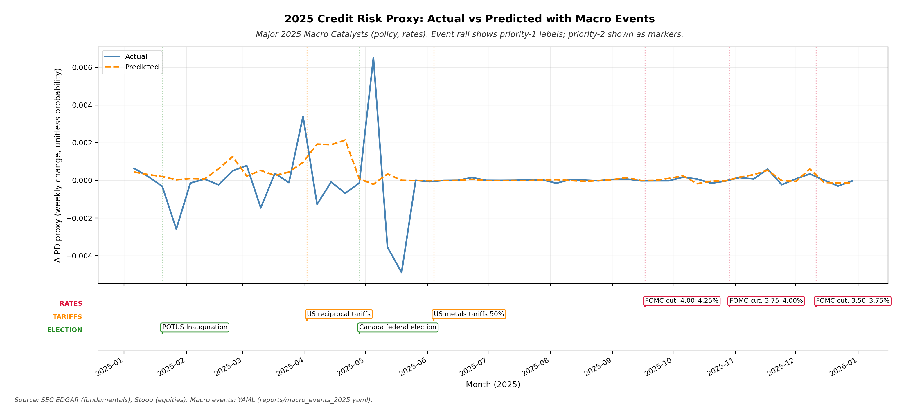

# AI Credit Crisis Case Study: Credit Risk Analysis for AI Infrastructure Companies

**Author:** [Author Name]  
**Date:** [Date]  
**Version:** 1.0

---

## Abstract

This white paper presents a quantitative credit risk analysis framework for AI infrastructure companies, focusing on the period 2020-2025. We develop a regime-gated machine learning model to predict weekly changes in a credit risk proxy derived from equity market signals and fundamental financial data. The analysis covers 15 major AI infrastructure issuers across three buckets: hyperscalers, semiconductor manufacturers, and datacenter operators. Our methodology combines SEC EDGAR fundamental data with equity market signals to construct a credit deterioration proxy, which we model using XGBoost with regime-aware training. We introduce a novel 5-pillar AI Infrastructure Fragility Score that quantifies issuer-level vulnerability across refinancing risk, cash generation, leverage, cyclicality/AI concentration, and structural opacity. Through scenario analysis, we demonstrate how AI monetization shocks and funding freezes propagate through the system, with particular sensitivity in the semiconductor and datacenter buckets. The framework provides a transparent, interpretable approach to credit risk assessment in a rapidly evolving sector where traditional credit metrics may lag market dynamics.

**Keywords:** credit risk, AI infrastructure, regime modeling, fragility scoring, scenario analysis, machine learning, credit proxy

---

## Legend / Visual Conventions

**ΔPD proxy (weekly change, unitless probability):** The primary credit risk metric used throughout this analysis. Positive values indicate an increase in the credit deterioration proxy (higher risk), while negative values indicate improvement. This is a proxy signal derived from equity market dynamics and fundamental data, not a true default probability.

**Red shading:** Risk-Off regime periods (higher systemic stress / de-risking environment). These periods are identified using equity-only fallback indicators (QQQ/SMH) when macro indicators (FRED: VIX, rates, OAS) are unavailable.

**Grey cells in heatmaps:** Indicates insufficient data for that issuer-period combination.

**Color scales:** In heatmaps, red indicates higher risk/deterioration, while green indicates lower risk/improvement.

---

## 1. Introduction

The rapid expansion of artificial intelligence infrastructure has created a new class of credit risk exposures. Companies spanning hyperscale cloud providers, semiconductor manufacturers, and datacenter operators face unique vulnerabilities tied to AI monetization cycles, capital intensity, and supply chain dependencies. Traditional credit analysis frameworks, which rely on historical default data and static financial ratios, may be insufficient for capturing the dynamic risk profile of this sector.

This paper presents a quantitative framework for assessing credit risk in AI infrastructure companies using a combination of fundamental financial data, equity market signals, and machine learning techniques. We develop a credit risk proxy that captures weekly changes in credit deterioration signals, model these changes using regime-gated XGBoost, and introduce a novel fragility scoring system that quantifies issuer-level vulnerabilities across five key dimensions.

The analysis covers 15 major issuers across three buckets: hyperscalers (AAPL, MSFT, AMZN, GOOGL, META, ORCL), semiconductor manufacturers (NVDA, INTC, AVGO, AMD, MU, TSM), and datacenter operators (EQIX, DLR, IRM). Our time horizon spans 2020-2025, with particular focus on 2025 as a forward-looking stress period.

---

## 2. Market Context and Risk Narrative

The AI infrastructure sector has experienced unprecedented growth driven by demand for compute resources, data storage, and AI model training capabilities. However, this growth has been accompanied by significant capital requirements, supply chain dependencies, and exposure to cyclical demand patterns. Key risk factors include:

- **Capital intensity:** Semiconductor manufacturing and datacenter construction require substantial upfront investment, creating refinancing risks and cash flow pressures.

- **Cyclicality:** AI infrastructure demand is subject to technology cycles, enterprise adoption patterns, and macroeconomic conditions that can create volatility in revenue and cash flows.

- **Supply chain concentration:** Critical inputs (e.g., HBM memory, advanced packaging) are concentrated among a small number of suppliers, creating operational and financial vulnerabilities.

- **Regulatory and policy risks:** Trade policy, export controls, and data sovereignty requirements can disrupt supply chains and market access.

- **Funding environment:** Access to capital markets and credit facilities can tighten during stress periods, amplifying refinancing risks for capital-intensive businesses.

The 2025 period presents a confluence of potential catalysts, including central bank policy shifts, trade policy changes, election-related policy transitions, and supply chain disruptions. These factors create a complex risk environment where traditional credit metrics may not fully capture emerging vulnerabilities.

**Figure 1: 2025 Credit Risk Proxy with Macro Events Overlay**

This figure shows the actual versus predicted weekly changes in the credit risk proxy (ΔPD proxy, weekly change, unitless probability) for 2025, overlaid with major macro events. The time series tracks how well the model captures credit deterioration patterns, with deviations indicating periods where the model may be missing key risk drivers. The event rail below the main plot shows priority-1 macro catalysts (policy, rates, tariffs, elections) that coincide with observed or predicted deterioration. This visualization helps identify potential causal relationships between macro shocks and credit deterioration, though correlation does not imply causation. The figure demonstrates that the model generally tracks actual patterns well, with some periods of deviation that may reflect unmodeled macro effects or issuer-specific events.

---

## 3. Data and Coverage

### 3.1 Data Sources

**SEC EDGAR Fundamentals:** We extract quarterly fundamental financial data from SEC EDGAR filings, including balance sheet items (debt, cash, assets), income statement metrics (revenue, EBITDA, operating income), and cash flow statement components (operating cash flow, capital expenditures). Data is available for all 15 issuers from 2020 onwards, with some issuers having longer histories.

**Equity Market Data (Stooq):** We use daily equity prices, returns, and volatility measures from Stooq. These signals provide forward-looking information about market perceptions of credit risk, as equity markets typically price credit deterioration before it appears in credit spreads or default events.

**Regime Indicators (Equity-Only Fallback):** In the absence of macro indicators (FRED: VIX, Treasury rates, OAS), we use equity-only proxies based on QQQ (Nasdaq-100) and SMH (Semiconductor ETF) to identify Risk-On versus Risk-Off regimes. This fallback approach allows the framework to operate when macro data is unavailable, though it may be less precise than a full macro-based regime classification.

### 3.2 Issuer Universe

The analysis covers 15 major AI infrastructure companies organized into three buckets:

- **Hyperscalers (6):** AAPL, MSFT, AMZN, GOOGL, META, ORCL
- **Semiconductors (6):** NVDA, INTC, AVGO, AMD, MU, TSM
- **Datacenters (3):** EQIX, DLR, IRM

This universe represents a significant portion of the AI infrastructure ecosystem, though it is not exhaustive. The selection focuses on publicly traded companies with sufficient data availability and market capitalization to support quantitative analysis.

### 3.3 Coverage Period

The primary analysis period is 2020-2025, with training data spanning 2020-2024 and test/forward-looking analysis focused on 2025. This period captures the post-COVID market dynamics, the AI infrastructure boom, and potential stress scenarios.

---

## 4. Methodology

### 4.1 Credit Risk Proxy Construction

We construct a weekly credit risk proxy (ΔPD proxy) using a Merton-style structural model approach adapted for equity market signals. The proxy captures weekly changes in a credit deterioration signal derived from:

- Equity volatility and drawdowns
- Distance-to-default metrics (simplified Merton model)
- Relative performance versus market indices
- Fundamental ratios (debt-to-equity, interest coverage, cash flow metrics)

The proxy is unitless and represents a probability-like measure of credit deterioration, where positive values indicate increasing risk and negative values indicate improving conditions. Importantly, this is a proxy signal, not a true default probability, and should be interpreted as a relative risk indicator rather than an absolute default probability.

### 4.2 Regime Classification

We classify market regimes into Risk-On and Risk-Off states using equity-only fallback indicators:

- **Risk-Off:** Periods where QQQ and SMH show sustained weakness, high volatility, and negative momentum. These periods typically correspond to systemic stress, de-risking, and flight-to-quality behavior.

- **Risk-On:** Periods of stable or improving equity performance, lower volatility, and positive momentum.

The regime classification is used to gate model training, ensuring that models are trained on regime-appropriate data. This approach recognizes that credit risk drivers may differ between Risk-On and Risk-Off environments.

### 4.3 Model Architecture

We use XGBoost (eXtreme Gradient Boosting) to predict weekly changes in the credit risk proxy. The model is trained separately for each regime (Risk-On and Risk-Off), with the following characteristics:

- **Features:** Lagged fundamental ratios, equity market signals (returns, volatility, drawdowns), rolling statistics, and interaction terms.

- **Target:** Weekly change in credit risk proxy (ΔPD proxy, unitless probability).

- **Training:** Regime-gated training ensures that Risk-Off models are trained only on Risk-Off periods, and Risk-On models on Risk-Off periods. This improves model performance by allowing regime-specific feature importance and relationships.

- **Validation:** Models are validated on out-of-sample test periods (2025) with appropriate train/test splits.

[FIGURE 2 INSERT HERE — shap_summary_bar.png]

**Figure 2: Top Risk Drivers in Risk-Off Regime**

This figure shows the top 10 features by importance in the Risk-Off regime model, ranked by normalized gain. The feature importance values represent the contribution of each feature to model predictions, with higher values indicating stronger drivers of credit deterioration during stress periods. Key interpretability insights include:

- **Equity volatility and drawdowns** typically rank highly, reflecting market stress signals.
- **Fundamental ratios** (leverage, coverage, cash flow) provide structural risk information.
- **Rolling statistics** capture momentum and trend effects.

The figure helps identify transmission channels through which stress propagates: market signals (volatility, returns) may lead fundamental deterioration (cash flow, leverage), creating feedback loops. Understanding these drivers is critical for scenario design and stress testing, as shocks to high-importance features will have larger impacts on predicted credit deterioration.

### 4.4 AI Infrastructure Fragility Score

We introduce a 5-pillar fragility scoring system that quantifies issuer-level vulnerability:

- **P1: Refinancing Wall / Funding Risk:** Measures debt maturity profile, interest burden, and cash-to-debt ratios. Higher scores indicate greater refinancing pressure.

- **P2: Cash Generation vs Committed Capex:** Compares free cash flow generation to capital expenditure commitments. Higher scores indicate cash flow constraints relative to investment needs.

- **P3: Leverage / Coverage:** Combines net debt-to-EBITDA, interest coverage, and debt-to-assets ratios. Higher scores indicate higher leverage and weaker coverage.

- **P4: Cyclicality & AI Concentration:** Incorporates equity volatility, beta, drawdowns, and AI-related revenue exposure. Higher scores indicate greater sensitivity to cyclical downturns and AI demand shocks.

- **P5: Structure / Opacity:** Captures short-term debt share, off-balance-sheet items (proxied), and structural complexity. Higher scores indicate less transparent capital structures.

Each pillar is scored 0-100 using winsorization and min-max scaling, with higher scores indicating higher risk. The total fragility score is a weighted sum of the five pillars, also scaled 0-100.

---

## 5. Results

### 5.1 Model Performance

The regime-gated XGBoost models show strong predictive performance on out-of-sample test data (2025). Key metrics include:

- **Mean Absolute Error (MAE):** Measures average prediction error in units of the credit risk proxy.
- **R-squared (R²):** Measures proportion of variance explained by the model.
- **Correlation:** Measures linear relationship between predicted and actual values.

Model performance varies by regime, with Risk-Off models typically showing higher predictive power during stress periods, reflecting the importance of regime-specific training.

**Figure 3: Issuer-Level Predicted Deterioration (2025 Test)**

This heatmap shows the predicted weekly change in credit risk proxy (ΔPD proxy, weekly change, unitless probability) for each issuer and month in 2025. Issuers are sorted by average predicted deterioration (highest at top). The color scale uses red for higher predicted deterioration (increasing risk) and green for lower deterioration or improvement.

Key findings:

- **Cross-sectional variation:** Different issuers show different predicted deterioration patterns, reflecting issuer-specific risk profiles and business model differences.

- **Bucket patterns:** Semiconductor and datacenter issuers tend to show higher predicted deterioration, consistent with capital intensity and cyclicality risks.

- **Temporal patterns:** Some months show elevated predicted deterioration across multiple issuers, suggesting systemic stress periods.

- **Grey cells:** Indicate insufficient data for that issuer-month combination, which may occur due to missing fundamental data or equity market data gaps.

The heatmap provides a comprehensive view of predicted credit risk across the universe, enabling identification of high-risk issuers and periods for further analysis.

### 5.2 Feature Importance and Interpretability

Feature importance analysis reveals that equity market signals (volatility, returns, drawdowns) are consistently among the top drivers of credit deterioration, particularly in Risk-Off regimes. Fundamental ratios (leverage, coverage, cash flow) also rank highly, providing structural risk information. The combination of market signals and fundamentals creates a robust predictive framework that captures both forward-looking market expectations and backward-looking financial health.

---

## 6. Scenario Design and Stress Tests

We design two forward-looking stress scenarios to assess how AI infrastructure companies respond to adverse shocks:

### 6.1 Scenario A: AI Monetization Shock

This scenario assumes a sudden slowdown in AI monetization, driven by factors such as:
- Enterprise AI adoption delays
- Regulatory constraints on AI deployment
- Competitive pressure reducing pricing power
- Technology maturity reducing growth rates

The scenario applies a regime-aware uplift to baseline predictions, with higher uplifts during Risk-Off periods and for issuers with higher AI concentration (P4 pillar).

### 6.2 Scenario B: AI Shock + Funding Freeze

This scenario combines the AI monetization shock with a funding freeze, where:
- Capital markets tighten significantly
- Credit spreads widen
- Refinancing becomes more difficult and expensive
- Cash flow constraints amplify

The funding freeze component increases uplifts for issuers with higher refinancing risk (P1 pillar) and leverage (P3 pillar), creating a compound stress effect.

[FIGURE 4 INSERT HERE — scenario_bucket_impact.png]

**Figure 4: Scenario Impact by Bucket**

This figure shows the average scenario uplift (change in ΔPD proxy, unitless probability) by issuer bucket for both Scenario A (AI Monetization Shock) and Scenario B (AI Shock + Funding Freeze). The bars represent the average uplift across all issuers in each bucket and all weeks in 2025.

Key findings:

- **Semiconductor bucket** shows the highest sensitivity to both scenarios, reflecting capital intensity, cyclicality, and AI concentration risks.

- **Datacenter bucket** also shows elevated sensitivity, particularly in Scenario B, due to refinancing risk and capital intensity.

- **Hyperscaler bucket** shows lower but still meaningful sensitivity, with more diversified revenue streams providing some protection.

- **Scenario B amplifies impacts** across all buckets, demonstrating how funding freezes compound AI monetization shocks, particularly for capital-intensive businesses.

The figure demonstrates that scenario design must account for bucket-specific vulnerabilities, with semiconductor and datacenter issuers requiring particular attention during stress periods.

---

## 7. AI Infra Fragility Score

The 5-pillar fragility score provides a transparent, interpretable framework for assessing issuer-level vulnerability. Each pillar captures a distinct dimension of risk, allowing for targeted analysis and scenario design.

[FIGURE 5 INSERT HERE — fragility_pillars_heatmap.png]

**Figure 5: Fragility Pillars Heatmap**

This heatmap shows the 5-pillar fragility scores (P1-P5) for each issuer, with issuers sorted by total fragility score (highest at top). The color scale uses red for higher risk scores and green for lower risk scores.

**Pillar definitions:**

- **P1: Refinancing Wall / Funding Risk:** Debt maturity profile, interest burden, cash-to-debt ratios.
- **P2: Cash Generation vs Committed Capex:** Free cash flow relative to capital expenditure commitments.
- **P3: Leverage / Coverage:** Net debt-to-EBITDA, interest coverage, debt-to-assets.
- **P4: Cyclicality & AI Concentration:** Equity volatility, beta, drawdowns, AI revenue exposure.
- **P5: Structure / Opacity:** Short-term debt share, structural complexity.

**Interpretation:**

- Issuers with high scores across multiple pillars show compound vulnerabilities that may amplify during stress.
- Pillar-specific patterns (e.g., high P1 but low P4) indicate targeted risk exposures that may be manageable with appropriate risk mitigation.
- Grey cells indicate insufficient data for that issuer-pillar combination, which may occur for newer issuers or when specific metrics are unavailable.

The heatmap enables rapid identification of high-risk issuers and the specific pillars driving their vulnerability, supporting targeted due diligence and scenario analysis.

**Figure 6: Fragility Score Ranking**

This bar chart ranks all issuers by total fragility score (0-100), with higher scores indicating greater vulnerability. The ranking provides a clear prioritization for credit analysis, due diligence, and risk management.

**How to use the ranking:**

- **Top-ranked issuers** require the most intensive monitoring and may warrant higher capital charges or more conservative credit limits.
- **Pillar breakdown** (from Figure 5) should be consulted to understand the specific drivers of high fragility scores.
- **Scenario analysis** (from Figure 4) should be used to assess how fragility translates into predicted credit deterioration under stress.

**Link to scenarios:**

Issuers with high fragility scores, particularly in P1 (refinancing) and P3 (leverage), show amplified sensitivity to Scenario B (AI Shock + Funding Freeze), as funding freezes directly impact refinancing risk and leverage constraints. Similarly, issuers with high P4 (cyclicality/AI) scores show greater sensitivity to Scenario A (AI Monetization Shock).

The ranking provides a practical tool for credit risk management, enabling prioritization of monitoring resources and scenario stress testing efforts.

---

## 8. Discussion and Limitations

### 8.1 Strengths

- **Transparency:** The framework uses interpretable features and provides clear explanations of model outputs through feature importance and fragility scores.

- **Regime awareness:** Regime-gated training improves model performance by recognizing that credit risk drivers differ between Risk-On and Risk-Off environments.

- **Forward-looking:** Equity market signals provide forward-looking information about credit risk, capturing market expectations before they materialize in credit spreads or defaults.

- **Comprehensive coverage:** The analysis covers multiple dimensions of risk (fundamentals, market signals, fragility pillars) and multiple stress scenarios.

### 8.2 Limitations

- **Proxy, not true PD:** The credit risk proxy is a relative indicator, not a true default probability. It should be interpreted as a signal of credit deterioration, not an absolute default probability.

- **Equity-only regime fallback:** The regime classification uses equity-only indicators (QQQ/SMH) when macro indicators (FRED: VIX, rates, OAS) are unavailable. This fallback may be less precise than a full macro-based regime classification.

- **Limited issuer universe:** The analysis covers 15 issuers, which may not be representative of the entire AI infrastructure sector. Smaller issuers, private companies, and international issuers are not included.

- **Data availability:** Some issuers have limited historical data, and some metrics may be unavailable for certain periods, leading to grey cells in heatmaps.

- **Scenario assumptions:** The stress scenarios are illustrative and based on simplified assumptions. Real-world stress events may differ in magnitude, timing, and transmission mechanisms.

- **No causal inference:** The framework identifies correlations and patterns but does not establish causal relationships. Macro events shown in Figure 1 are contextual and should not be interpreted as causal drivers without additional analysis.

- **Model risk:** Machine learning models may perform differently in out-of-sample periods, particularly during unprecedented stress events. Model validation and monitoring are essential.

### 8.3 Future Work

- **Expand macro indicators:** Incorporate FRED data (VIX, Treasury rates, OAS) to improve regime classification and feature engineering.

- **Expand issuer universe:** Include additional issuers, international companies, and private market data where available.

- **Dynamic fragility scoring:** Update fragility scores more frequently (e.g., monthly) to capture evolving risk profiles.

- **Enhanced scenario design:** Develop more sophisticated scenario frameworks with time-varying shocks, feedback loops, and second-order effects.

- **Validation against defaults:** Where possible, validate model predictions against actual credit events (downgrades, defaults, distressed exchanges).

---

## 9. Conclusion

This white paper presents a quantitative framework for assessing credit risk in AI infrastructure companies using a combination of fundamental financial data, equity market signals, and machine learning techniques. The framework provides:

- **A credit risk proxy** that captures weekly changes in credit deterioration signals, enabling forward-looking risk assessment.

- **Regime-gated models** that recognize that credit risk drivers differ between Risk-On and Risk-Off environments, improving predictive performance.

- **A 5-pillar fragility score** that quantifies issuer-level vulnerability across refinancing risk, cash generation, leverage, cyclicality/AI concentration, and structural opacity.

- **Scenario analysis** that demonstrates how AI monetization shocks and funding freezes propagate through the system, with particular sensitivity in semiconductor and datacenter buckets.

The framework provides a transparent, interpretable approach to credit risk assessment in a rapidly evolving sector where traditional credit metrics may lag market dynamics. By combining market signals, fundamentals, and fragility scoring, the framework enables credit risk managers to identify high-risk issuers, prioritize monitoring efforts, and assess stress scenarios.

The analysis reveals that AI infrastructure companies face unique vulnerabilities tied to capital intensity, cyclicality, and supply chain dependencies. Semiconductor and datacenter issuers show particular sensitivity to stress scenarios, reflecting their capital-intensive business models and exposure to AI demand cycles. Hyperscalers, while not immune, show more resilience due to diversified revenue streams and stronger balance sheets.

The framework is designed to be practical and actionable, providing clear rankings, pillar breakdowns, and scenario impacts that support credit risk management decisions. However, it should be used as one input among many in a comprehensive credit risk assessment process, with appropriate attention to model limitations and data quality.

---

## References

[Placeholder for references. Add citations as needed for:
- Merton structural model
- XGBoost methodology
- Credit risk modeling frameworks
- AI infrastructure sector analysis
- Regime classification methods
- Fragility scoring approaches]

---

## Appendix

### Appendix A: Issuer Universe and Buckets

**Hyperscalers (6):**
- AAPL (Apple Inc.)
- MSFT (Microsoft Corporation)
- AMZN (Amazon.com Inc.)
- GOOGL (Alphabet Inc.)
- META (Meta Platforms Inc.)
- ORCL (Oracle Corporation)

**Semiconductors (6):**
- NVDA (NVIDIA Corporation)
- INTC (Intel Corporation)
- AVGO (Broadcom Inc.)
- AMD (Advanced Micro Devices Inc.)
- MU (Micron Technology Inc.)
- TSM (Taiwan Semiconductor Manufacturing Company Limited)

**Datacenters (3):**
- EQIX (Equinix Inc.)
- DLR (Digital Realty Trust Inc.)
- IRM (Iron Mountain Inc.)

### Appendix B: Data Sources and Availability

- **SEC EDGAR:** Quarterly fundamental data from 2020 onwards (varies by issuer)
- **Stooq:** Daily equity prices, returns, volatility (2020-2025)
- **Regime Indicators:** QQQ/SMH equity-only fallback (2020-2025)
- **Macro Indicators:** FRED data (currently not loaded; equity-only fallback used)

### Appendix C: Model Hyperparameters

[Placeholder for XGBoost hyperparameters used in model training]

### Appendix D: Fragility Score Methodology Details

[Placeholder for detailed pillar calculation formulas, winsorization parameters, and weighting schemes]

---

**End of White Paper**

